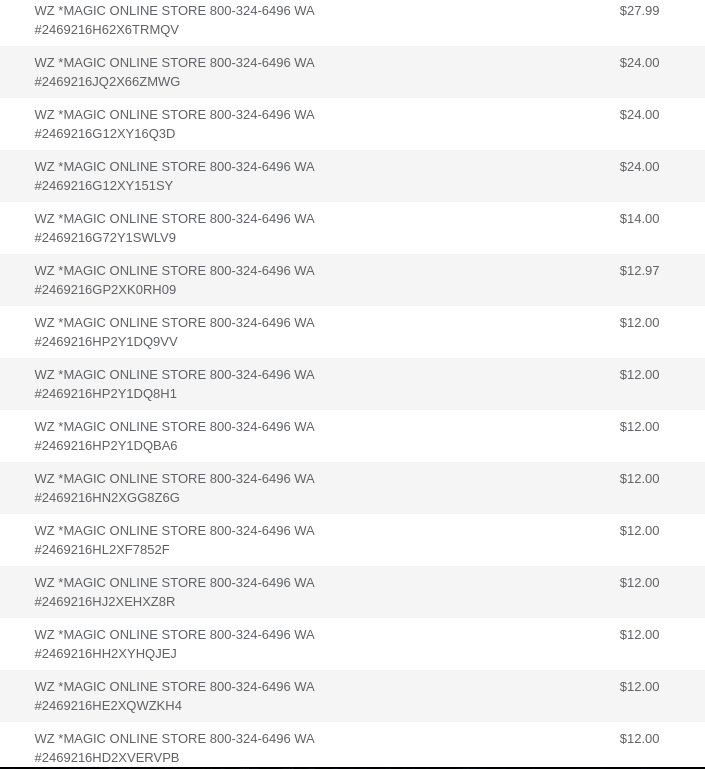

I know I promised a tutorial for Gatsby Remark PrismJS, but that will have to go by the wayside for now.

It's been awhile, blog! It's also been awhile for programming in general. These past few months have been a lot of me
working out, volunteering at the animal shelter, and above all else staying dedicated to the development of several
public outreach programs to help the needy of my city!

Just kidding. This is what really happened:

