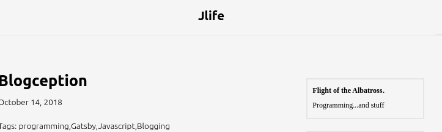
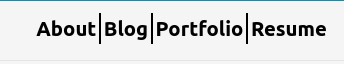
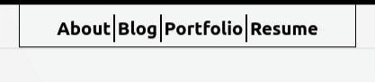

This blog will be about improving my blog, and building the website that (hopefully) encapsulates the blog in the future!

At the time of writing, this blog is mostly the brainchild of a random person's tutorial on Medium that I found awhile back. Now that I've built a multitude of *industry level*, *production-ready*, and *unit-tested* React applications for my workplace, I think I'm ready to make this thing into my own.

I even took the time to sketch out a plan for the site! My drawing skills aren't the best, but I promise it makes at least *a little bit* of sense:


<center><em>Beautiful, isn't it?</em></center>

As a word of warning, I'm writing this blog post **as I code**. I want to avoid the feeling that I've encountered in other blogs where things are just too polished and make way too much...sense. It's a bit hard to explain, but the main point of this blog is for me to record my pitfalls and struggles, so that if you have them too (or if I decide to look back on this blog), we'll both know where we went wrong and how we fixed it!

Anyway, we're going to start off small by building that beautiful header. Here's what we have right now:
```js
import React from 'react'
import Link from 'gatsby-link'

const Header = () => (
  <div
    style={{
      background: '#f5f5f5',
      marginBottom: '3rem',
      borderBottom: '2px solid #e6e6e6',
    }}
  >
    <div
      style={{
        margin: '0 auto',
        maxWidth: 980,
        padding: '1.45rem 1.0875rem',
      }}
   >
     <h1 style={{margin: 0, textAlign: 'center',fontSize: '18px'}}>
        <Link to="/"
          style={{
            color: 'black',
            textDecoration: 'none',
          }}
        >
          Jlife
        </Link>
      </h1>
    </div>
  </div>
);

export default Header

```
In picture form (the Jlife part):


Let's change the text first! We want it to be About | Blog | Portfolio | Resume. Now, we could just change the header text to that, but we don't want to. Why? Because we need each of the separate sections to **link to separate pages**. Therefore, we'll need each separate section to be its own HTML element.

```js
//Instead of doing this:
<Link to="/"
          style={{
            color: 'black',
            textDecoration: 'none',
          }}
        >
        About | Blog | Portfolio | Resume
        </Link>


//We will do this:
<Link to="/About"
          style={{
            color: 'black',
            textDecoration: 'none',
          }}
        >
          About
        </Link>

<Link to="/Blog"
          style={{
            color: 'black',
            textDecoration: 'none',
          }}
        >
          Blog
        </Link>

<Link to="/Portfolio"
          style={{
            color: 'black',
            textDecoration: 'none',
          }}
        >
          Portfolio
        </Link>

<Link to="/Resume"
          style={{
            color: 'black',
            textDecoration: 'none',
          }}
        >
          Resume
        </Link>
```

Now, I know what you're thinking (I'm thinking it too): 

> **This is ugly! DRY! DRY!!!!!!**

Yes, don't repeat yourself. Let's create a **functional stateless component** to make the repeated stuff look a bit nicer. 

```js
const HeaderLink = (props) => {
  const headerTextStyle = {{
      color: 'black',
      textDecoration: 'none'
    }}

  return <Link to={props.linkLocation} style= {headerTextStyle}>{props.title}</Link>
}

```

We're going to make a new file for this component. I'm calling it 'HeaderLink.js' and placing it in the same directory as my component (for me this is located in a folder called Headers). This seems reasonable, because it's a subcomponent of the Header. There's an argument to simply keep it in the same file as the Header as function, but I like the idea of having the option of reusing this sometime in the future if needed.

Here's the new code for the header part:
```js
    <HeaderLink linkLocation="/About" title="About"/>
    <HeaderLink linkLocation="/Blog" title="Blog"/>
    <HeaderLink linkLocation="/Portfolio" title="Portfolio"/>
    <HeaderLink linkLocation="/Resume" title="Resume"/>
```

The updated header file:
```js
import React from 'react'
import HeaderLink from './HeaderLink'

const Header = () => (
  <div
    style={{
      background: '#f5f5f5',
      marginBottom: '3rem',
      borderBottom: '2px solid #e6e6e6',
    }}
  >
    <div
      style={{
        margin: '0 auto',
        maxWidth: 980,
        padding: '1.45rem 1.0875rem',
      }}
   >
     <h1 style={{margin: 0, textAlign: 'center',fontSize: '18px'}}>
        <HeaderLink linkLocation="/about" title="About"/>
        <HeaderLink linkLocation="/blog" title="Blog"/>
        <HeaderLink linkLocation="/portfolio" title="Portfolio"/>
        <HeaderLink linkLocation="/resume" title="Resume"/>
      </h1>
    </div>
  </div>
);

export default Header

```

And the newly created HeaderLink.js file:
```js
import React from 'react'
import Link from 'gatsby-link'

const HeaderLink = (props) => {
  const headerTextStyle = {
      color: 'black',
      textDecoration: 'none'
    }

  return <Link to={props.linkLocation} style={headerTextStyle}>{props.title}</Link>
}

export default HeaderLink

```

Note that we moved the dependency to **Link** from Header to HeaderLink!

We need the text for each link to be seperated, because this is what we have so far:


After trying to simply put a | after each <HeaderLink/> element (it didn't work), my next bet is to set the padding around each HeaderLink in the headerLinkStyle. After some experimentation, I think that a padding of 5px looks alright.

```js
const HeaderLink = (props) => {
  const headerTextStyle = {{
      color: 'black',
      textDecoration: 'none',
      padding: '5px'
    }}

  return <Link to={props.linkLocation} style= {headerTextStyle}>{props.title}</Link>
}
```


Finally, I need to put in the line separators for each section. However, the problem seems to be that the About and Resume sections will not want the borders on their left and right, respectively. What I can do is pass another style option to each HeaderLink props which specifies custom CSS styling for each HeaderLink. In the HeaderLink function, we can account for the addition of the prop using ES6's handy spread operator!

Behold:

```js
//The updated HeaderLink function
const HeaderLink = (props) => {
  const headerTextStyle = {{
      color: 'black',
      textDecoration: 'none',
      padding: '5px',
      ...props.style //we put this last so that it gets priority in CSS!
    }}

  return <Link to={props.linkLocation} style={headerTextStyle}>{props.title}</Link>

}

//Changes to each HeaderLink component
    <HeaderLink linkLocation="/about" title="About" style={{borderRight: "1px solid black"}}/>
    <HeaderLink linkLocation="/blog" title="Blog" style={{borderRight: "1px solid black", borderLeft: "1px solid black"}}/>
    <HeaderLink linkLocation="/portfolio" title="Portfolio" style={{borderRight: "1px solid black", borderLeft: "1px solid black"}}/>
    <HeaderLink linkLocation="/resume" title="Resume" style={{borderLeft: "1px solid black"}} />
```


We're almost done! Now, we just need a nice border for our header. Let's throw in an animation on hover too.

## The Border

This isn't too bad. We just need to change the div that houses all of the nav icons to have a black border. After putting in the border, I noticed things looked a little too big, so I scaled down the max width and added a height.
```js
import React from 'react'
import HeaderLink from './HeaderLink'

const Header = () => (
  <div
    style={{
      background: '#f5f5f5',
      marginBottom: '3rem',
      borderBottom: '2px solid #e6e6e6',
    }}
  >
    <div
      style={{
        margin: '0 auto',
        maxWidth: '500px', //  Changed width
        height: '18px', // Added height
        padding: '1.45rem 1.0875rem',
        border: '1px solid black' //  Border
      }}
   >
     <h1 style={{ textAlign: 'center',fontSize: '18px'}}>
      <HeaderLink linkLocation="/about" title="About" style={{borderRight: "1px solid black"}}/>
      <HeaderLink linkLocation="/blog" title="Blog" style={{borderRight: "1px solid black", borderLeft: "1px solid black"}}/>
      <HeaderLink linkLocation="/portfolio" title="Portfolio" style={{borderRight: "1px solid black", borderLeft: "1px solid black"}}/>
      <HeaderLink linkLocation="/resume" title="Resume" style={{borderLeft: "1px solid black"}} />
      </h1>
    </div>
  </div>
);

export default Header

```

## The Hover Effect

In making this, I learned something: **React inline styling does not have support for pseudo selectors!** So, I did a bit of Gooling and decided to employ [emotion](https://github.com/emotion-js/emotion) to get the desired effect. Here is the updated HeaderLink file:
```js
import React from 'react';
import Link from 'gatsby-link';
import { css } from 'emotion';


const HeaderLink = (props) => {
  const headerTextStyle = {
      color: 'black',
      textDecoration: 'none',
      padding: '5px',
      '&:hover': {
        'background': '#ccc'
      },

      ...props.style //we put this last so that it gets priority in CSS!
    }

  return <Link to={props.linkLocation} className={css(headerTextStyle)}>{props.title}</Link>
}

export default HeaderLink
```

1. We added the dependency to emotion and added a new element in headerTextStyle using emotion's syntax for CSS pseudo selectors. I elected to just have the background change to a light gray, #ccc.
2. Instead of setting the style attribute for the returned Link element, we have its className set to the return value of emotion's css evaluation of our headerTextStyle. This is required in order for emotion to work properly.

Now, the fruits of our labor:



And that's it for this blog post! We'll look into implementing the rest of the layout for next time.
