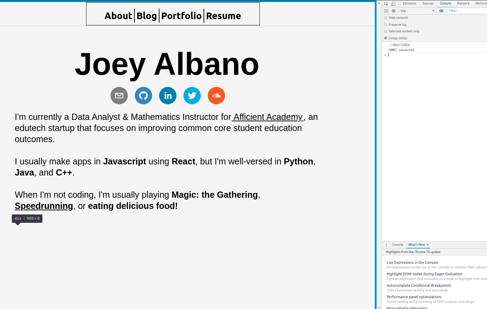
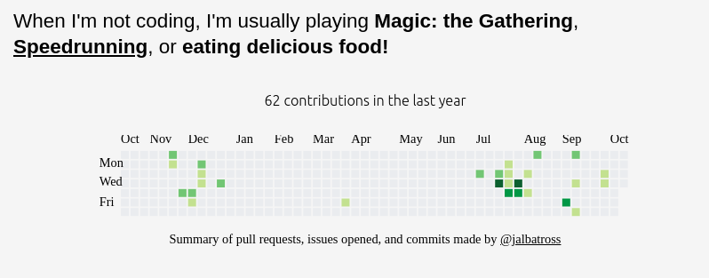

I've decided that **Blogception** will be a series of blogs about making a website for a blog.

Welcome to part 2! Here, we'll be making the homepage, which will be the default page opened when we enter the blog. It will also be accessible to users who click the About section in the header above.

Let's get started!

We'll begin by making a simple template for the about page in the pages directory.

```js
/**
 * about.js
 * 
 * An About page
 *
 * Author: jalbatross Oct 15 2018
 * 
 */

import React from "react";

const About = (props) => {
  return (
    <div className="about-page">
      Hello World
    </div>
  )
}

export default About;

```


<center><em>the classic</em></center>


Now that this is working, let's create a template for what we want to implement.

```js
import React from "react";

const AboutName = () => {
  return null;
}

const AboutIcons = () => {
  return null;
}

const AboutBio = () => {
  return null;
}

const About = () => {

  return (
    <div className="about-page">
      <AboutName/>
      <AboutIcons/>
      <AboutBio/>
    </div>
  )
}

export default About;
```

1. For the name, we'll keep it simple for now and have my name in big letters. Maybe a fancy font, too.
2. For the icons, I want my Gmail, Github, and LinkedIn at least.
3. We'll keep the bio short and sweet.

# Name Section
This part shouldn't be too hard. We want things big and center aligned. There's padding on the bottom to make sure that there's enough space between the name title and the icons beneath.

```js
const AboutName = () => {
  const aboutNameStyling = {
    textAlign: 'center',
    fontSize: '90px', 
    fontFamily: 'Arial',
    fontWeight: 'bold',
    paddingBottom:'40px'
  }
  return <div style={aboutNameStyling}>Joey Albano</div>
}
```

# Icons
For the icons, I elected to use [Social Icons](https://github.com/jaketrent/react-social-icons). After installing the npm package, the finished product looks like so: 
```js
const AboutIcons = () => {
  const aboutIconContainerStyling = {
    textAlign: 'center'
  }
  return (
    <div className={aboutIconContainerStyling}>
      <SocialIcon url="mailto:joeycalbano@gmail.com"/>
      <SocialIcon url="https://github.com/jalbatross"/>
      <SocialIcon url="https://linkedin.com/in/jalbatross"/>
      <SocialIcon url="https://twitter.com/joeyalbatross"/>
      <SocialIcon url="https://soundcloud.com/jcal69"/>
    </div>
  )
}
```
I ran into some trouble here with the icons. Initially, they were smushed together like this:

<center><em>Too close for comfort</em></center>

A little margin between each element should fix the problem. Now, I could just assign a custom
margin styling for each element, but I'm lazy so I'll use a package we installed earlier in
Blogception 1: [**emotion**](https://emotion.sh/). This will allow us to use the CSS child selector; 
now, we can just write one line of code to apply the spacing around each icon!
```js
  const aboutIconContainerStyling = {
    textAlign: 'center',
    "& > *": {
      'margin': '10px'
    }
  }
  return (
    <div className={css(aboutIconContainerStyling)}>
    //etc...
```
Now we've got:


# The Bio
Now for the bio. This part is pretty straightforward - the only thing I have to mention here is the addition of padding for the
bio container to provide a bit of spacing around it and the icons.
```js
const AboutBio = () => {
  const aboutBioStyling = {
    fontSize: '25px',
    padding: '10px',
    fontFamily: 'Arial'
  }
  return (
    <div>
      <p style={aboutBioStyling}>
      I'm currently a Data Analyst & Mathematics Instructor for 
      <a href="https://afficienta.com"> Afficient Academy</a>, an edutech startup
      that focuses on improving common core student education outcomes.
      <br/><br/>
      I usually make apps in <b>Javascript</b> using <b>React</b>, but I'm well-versed
      in <b>Python</b>, <b>Java</b>, and <b>C++</b>.
      <br/><br/>
      When I'm not coding, I'm usually playing <b>Magic: the Gathering</b>, <b><a href="https://www.speedrun.com/user/Jalby">Speedrunning</a></b>, 
      or <b>eating delicious food!</b>
      </p>
    </div>
  )
}
```
The result:


# Extra Credit

If you look back at [Blogception 1](/blogecption), you'll see that there was one more box at the bottom of the about page that I wanted. That was for a heatmap of my Github contributions. After some experimentation, it looks like the [function responsible for generating that heatmap](https://www.npmjs.com/package/github-calendar) requires a reference to a ReactDOM element, which means I need to change About from a stateless functional component to a normal stateful React component.
```js
class About extends React.Component {
  constructor(props) {
    super(props);
  }

  //Doesn't do anything yet
  renderGithubContributions = () => {
    return null;
  }

  render() {
    const containerStyling = {
      margin: '0 auto',
    }

    const renderGithubContributions = this.renderGithubContributions();//Doesn't do anything yet

    return (
      <div className="about-page" style={containerStyling} >
        <AboutName/>
        <AboutIcons/>
        <AboutBio/>
        {GithubContributions} //Where our contribution calendar will go
      </div>
    )
  }
}
```
Reading the documentation for GitHubCalendar, you can see that the first argument that the function takes is a DOM container. Since we're using React and not jQuery or native JS, the way we can accomplish that is by creating a ref to a ReactDOM element. Since this project uses an older version of React, we have to use callbacks to get refs. We can accomplish this like so:

```js
  
  constructor(props) {
    super(props);
    this.calendarRef = null; //Instantiate a variable for our ref
  }

  componentDidMount() {
    console.log(this.calendarRef);
  }


  renderGithubContributions = () => {
    const githubCalendarStyling = {
      textAlign: 'center'
    }
    
    return (
      //This callback assigns a reference to the div that renderGithubContributions returns
      <div ref={(e) => (this.calendarRef = e)}></div> 
    )
  }
```
Now, if we refresh the page we can see the result in our console. If you hover over the ref in the console with your mouse, you can actually see a little popup for where the ref is on the DOM!


Now that we have our ref, we can use our GitHubCalendar method.
```js
  
  constructor(props) {
    super(props);
    this.calendarRef = null; //Instantiate a variable for our ref
  }

  componentDidMount() {
    GitHubCalendar(this.calendarRef, 'jalbatross', {global_stats: false});
  }


  renderGithubContributions = () => {
    const githubCalendarStyling = {
      textAlign: 'center'
    }
    
    return (
      //This callback assigns a reference to the div that renderGithubContributions returns
      <div ref={(e) => (this.calendarRef = e)}></div> 
    )
  }
```
Why do we make the call to GitHubCalendar in componentDidMount? Simply because [componentDidMount is called after refs are updated/set](http://projects.wojtekmaj.pl/react-lifecycle-methods-diagram/); we wouldn't want to call the function if we didn't have a ref ready for it yet! 

Note that global_stats to false because it didn't look nice. Moving on, this is what we have:

<center><em>Yuck!!</em></center>

Let's open up our Chrome console and see what the heck is going on here:


Looks like we had some unintended consequences from using an external library! Monkey patching time. There are a few ways of going about this: the first would be looking through the source of the node module and editing the JS so that we don't get the bottom monstrosity. Another thing we could do is some CSS editing to make it so that this bottom part renders in a nice way. Or, we could just hide it using CSS and not worry about it, which is what I've elected to do in this situation.

Since all of the offending material is conveniently located in one class, we can use CSS to hide it! Yay for CSS.

```js
  
  constructor(props) {
    super(props);
    this.calendarRef = null; //Instantiate a variable for our ref
  }

  componentDidMount() {
    GitHubCalendar(this.calendarRef, 'jalbatross', {global_stats: false});
  }


  renderGithubContributions = () => {
    const githubCalendarStyling = {
      textAlign: 'center',
      //Hides the bottom part that we don't want
      "& .contrib-legend": {
        display: 'none'
      }
      
    }
    return (
      <div className={css(githubCalendarStyling)} ref={(e) => (this.calendarRef = e)}></div>
    )
  }
```

<center><em>Voila</em></center>

Now let's put the cherry on top. My...mug!
```js
import myPicture from './resources-about/me.jpg'

const AboutPicture = () => {
  const aboutPictureStyling = {
    //Centers the image
    display:'block',
    marginLeft: 'auto',
    marginRight: 'auto',

    //Circle border
    borderRadius: '50%',

    //Make it smaller!
    width:'25%',
    height:'25%'
  }
  return 
}
```


# Wrapping things up
In this blog, we went over how to create a simple about/landing/home page for a Gatsby portfolio.

We ran into a few difficulties, especially when we wanted to use an external library (GitHubCalendar) that wasn't built with React in mind. However, with a little bit of elbow grease, we were able to get things looking nice in no time!

I hope this has been enjoyable for you. I'm not sure what I'd like to do for the next blog, but it'll probabaly be fixing the overall layout of the site - those of you who are observant will probably notice that I did away with the awkward sidebars midway through this blog!

Until next time.


