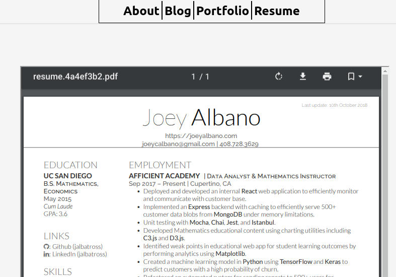
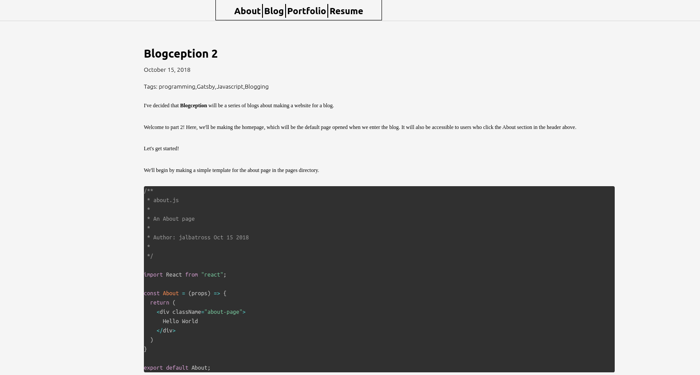
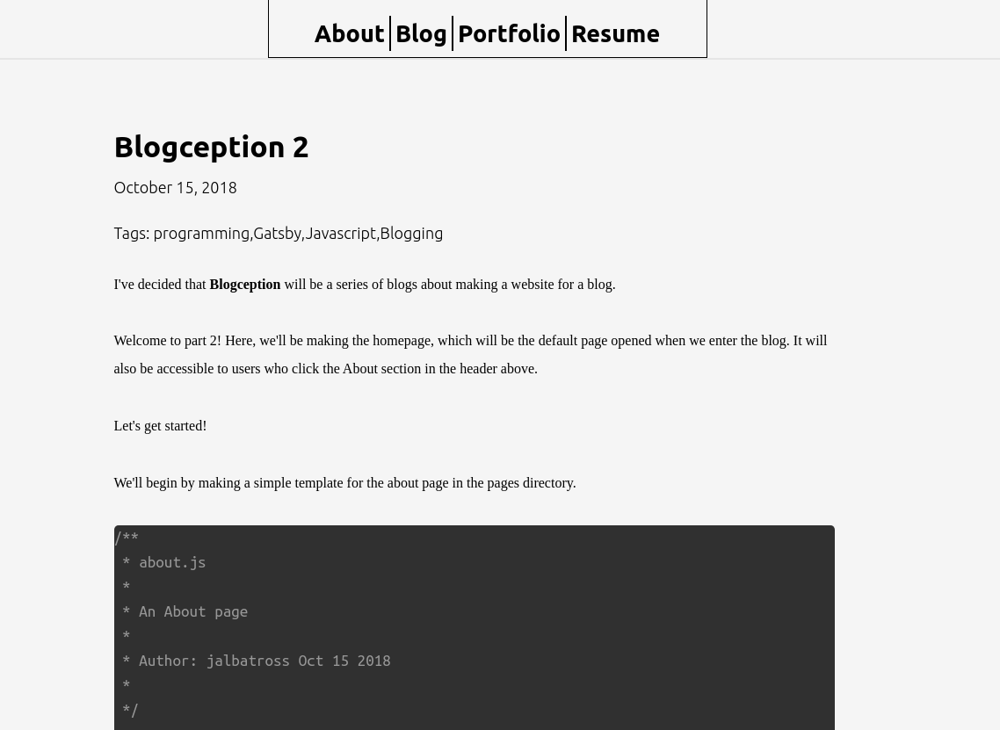

Back again! Unlike the other blogs, this one will be **retroactive**. I already implemented the updates
and will go over the changes. This is due to the fact that these changes were relatively simple and 
didn't pose any interesting challenges.

# Resume Page
For this, we simply want to display my resume. I created a folder in my Gatsby pages directory for 
housing my resume and any other resources that I'd want to place on the resume page later. Then,
I made an iframe to embed the resume directly in the page and set the size of that iframe to
the dimensions of standard letter paper, which makes sense because my resume was meant to be
one page large!

The code:
```js
import React from 'react';
import resume from './resources-resume/resume.pdf';
const Resume = () => {
  return <iframe src={resume} style={{height:'11in',width:'8.5in',}}/>
}

export default Resume;
```
And the result:


# Layout Changes
In the older version of the site, we had something like this going on with the blogs:


I didn't like how things seemed to spread out to the right. I took a look in my layout file (this is Gatsby v1), and found this:
```js
const TemplateWrapper = ({ children }) => (
  <div>
    <Helmet
      title="Joey Albano"
      meta={[
        { name: "description", content: "Joey Albano's Webpage" },
        { name: "keywords", content: "Joey Albano, HTML, React, Javascript, Programming" },
        { name: 'author', content: 'Joey Albano'},
      ]}
    />
    <Header />
    <div
      style={{
        margin: "0 auto",
        maxWidth: 980,
        display: "flex",
        flexDirection: "row",
        justifyContent: "space-between",
        height: "100%"
      }}
    >
      <Media query={{ maxWidth: 848 }}>
        {matches =>
          matches ? (
            <div
              style={{
                margin: "0 auto",
                maxWidth: 980,
                display: "flex",
                flexDirection: "row",
                justifyContent: "space-between",
                height: "100%",
                padding: "25px"
              }}
            >
              <div style={{ flex: 1 }}>{children()}</div>
            </div>
          ) : (
            <div 
              style={{
                margin: "0 auto",
                maxWidth: 980,
                display: "flex",
                flexDirection: "row",
                justifyContent: "space-between",
                height: "100%",
                padding: "25px"
              }}
            >
              <div style={{ flex: 2.5, paddingRight: "30px" }}>
                {children()}
              </div>
            </div>
          )
        }
      </Media>
    </div>
  </div>
)
```

You'll notice that the flexDirection is...row? That's not right at all! In my head, I imagine my blogs much like Medium blog posts: roughly vertically centered in a nice columnar shape. 

Anyway, it's a simple fix: just change the flexDirection to column and things should be dandy. And dandy they are. Note that I also decided to change the maxWidth of the children elements to 900 for a more narrow look.


# Minor Text Fixes
An update to the line height of the code blocks, from 1.something to 1, and overflow set to auto. I wanted the code blocks to be
more compact.

```css
.gatsby-highlight pre[class*="language-"] {
  margin: 0;
  padding: 0;
  overflow: auto; /* changed from inherit to auto */
  float: left; 
  min-width: 100%;
  line-height:1; /* added in */
}
```

And that's all for this blog! Shorter than the rest, but like I said the changes were a lot simpler. Things are starting to come around
and almost all of the links for our header have been implemented! We'll do the Portfolio part next and maybe think about adding in some more fancy cosmetic changes.
